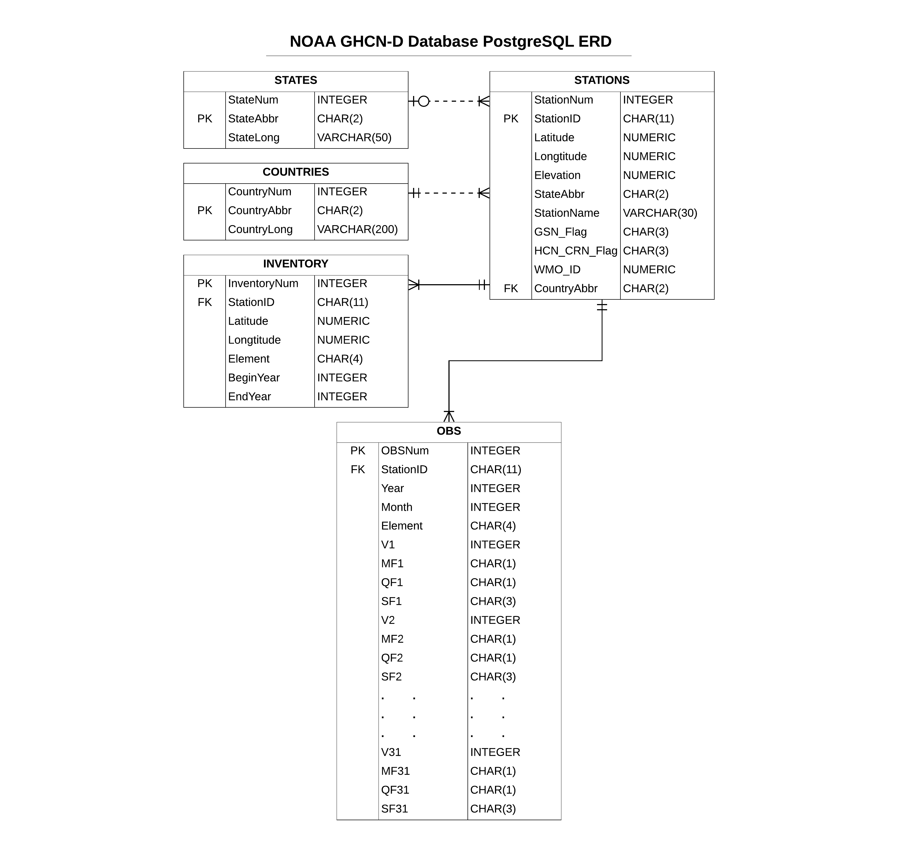

# NOAA_BigData
 
Objective of this project: Make NOAA's Global Historical Climatalogy Network Daily (GHCN-D)
data readily available to query for specific locations on a range of granularity levels.  NOAA 
provides free access to this data which is updated on a daily basis.

Complete:
- convert NOAA's .txt fact files into .csv (fixed-width, using Pandas)
- fact file imports into Postgres database using COPY
- SQL script to build Postgres DB, tables for fact files
- ERD
- Postgres import of full dataset

