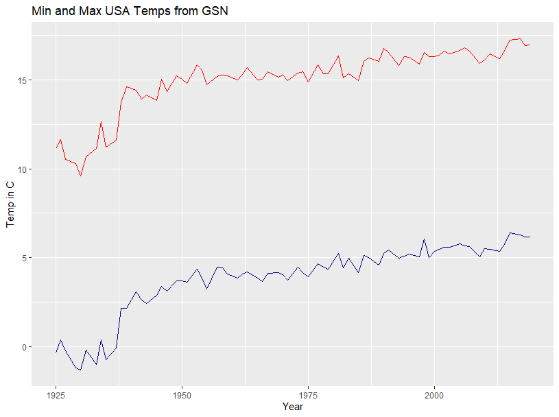
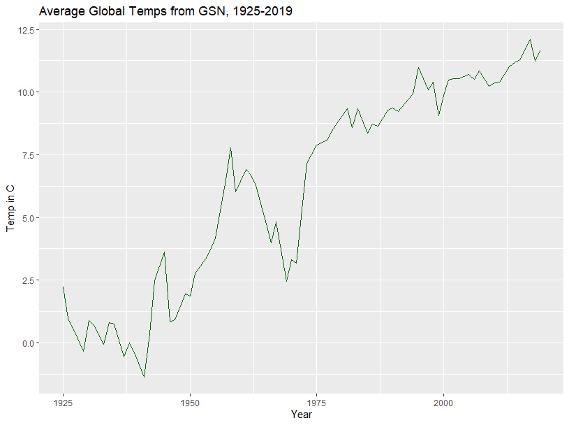

# NOAA GHCN-D
### Conversion, ingestion, PostgreSQL database build, querying
 
Objective of this project: Make NOAA's Global Historical Climatalogy Network Daily (GHCN-D)
data readily available to query for all locations on a range of granularity levels.  NOAA 
provides free access to this data which is updated on a daily basis.  Using Python and SQL 
to convert the files to .csv and then build a database for querying.

LINK TO DATA FILES - download "ghcnd_all.tar.gz" --> ftp://ftp.ncdc.noaa.gov/pub/data/ghcn/daily

### Read the doc about data structure, contents, etc.
Highly recommended, at least skim it.   [CLICK LINK TO SEE .TXT FILE](./data/text_files/DataInfo_readme.txt)

### Converting `.dly` files to `.csv` and upload to Postgres Database
For an overview on converting the `ghcnd-all.tar.gz` dataset to .csv, 
[see my other repo by clicking here](https://github.com/mathemacode/NOAA_GHCND_IMPORT).  This
guide also includes information about uploading this dataset into a Postgres database, which
can then be used in conjunction with the SQL queries in [the SQL folder](./SQL).

### Project scope
Complete:
- Convert NOAA's .txt fact files into .csv (fixed-width, using Pandas)
- Fact file imports into Postgres database using COPY
- SQL script to build Postgres DB, tables for fact files
- Entity-Relationship Diagram / ERD below
- Postgres import of full dataset (roughly 25gb after `.csv` conversion)
- Optimized queries for entire country yearly averages
- Exported GSN-station-only data to `.csv`
- Ingested GSN-station-only data into Apache Spark

Need to add to this ReadMe:
- Intro to NOAA, the data, limitations, etc
- Use of sed & stat error
- Query performance (20 min down to 5!)
- Main query explanation (`buildAVERAGES.sql`)

TODO Coding:
- Queries for #-year averages (of all stations or GSN, etc.)
- Further query performance optimization

### Database Schema - PostgreSQL

### GSN Max & Min Temp Records (USA) 1925-2019

### GSN Average Temp Records (Global) 1925-2019

